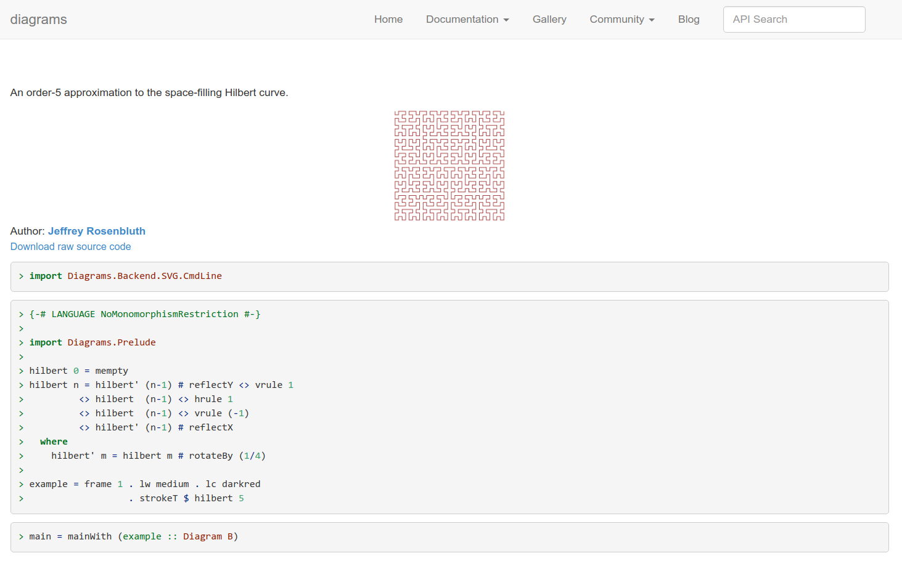
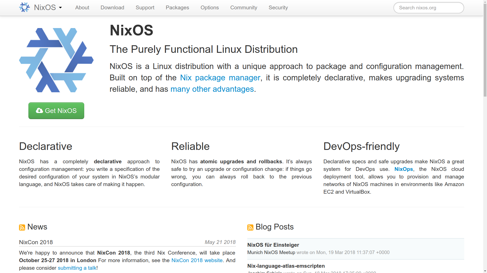
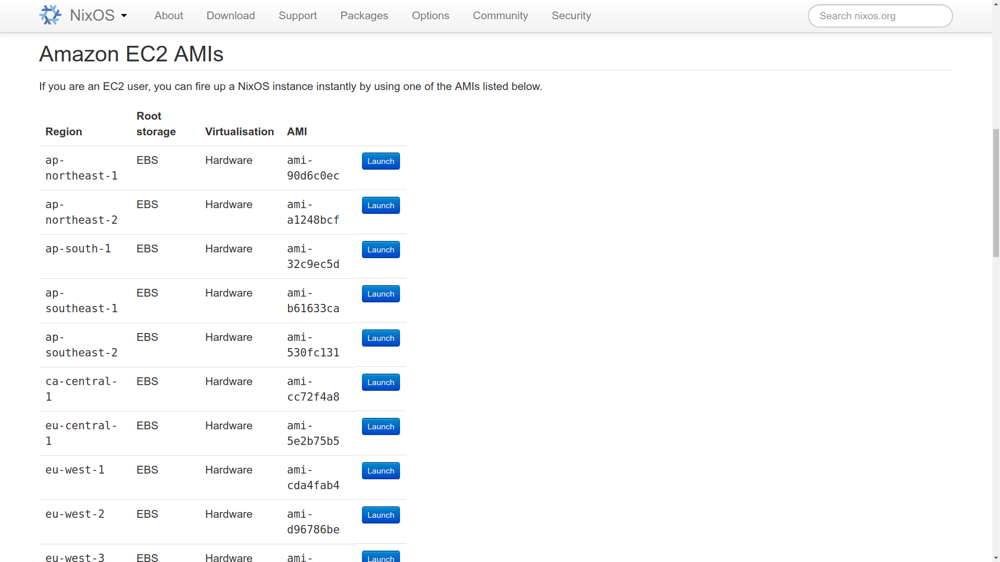
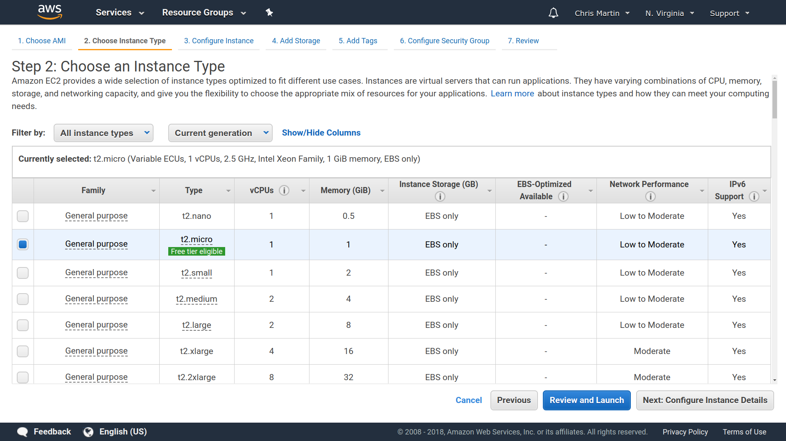
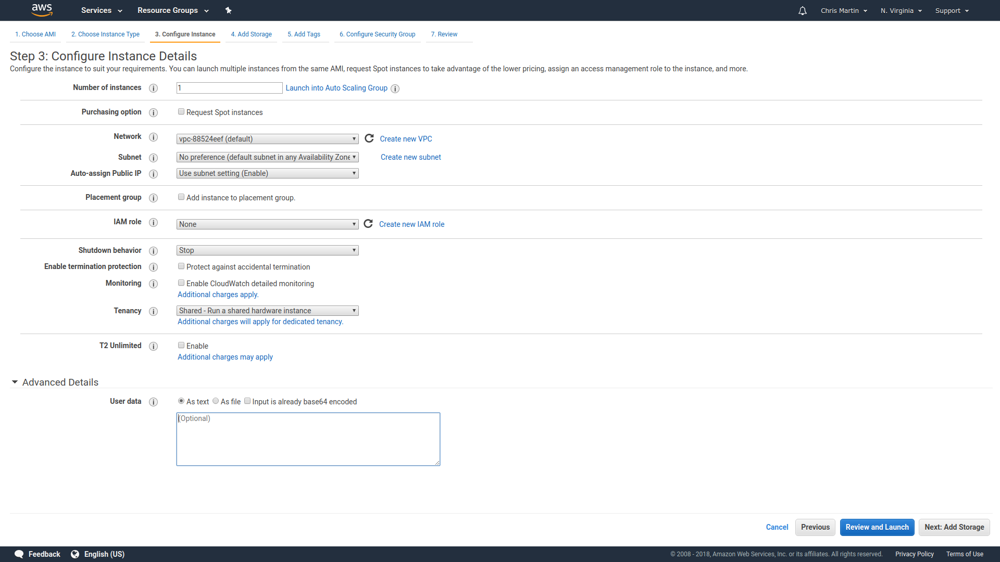
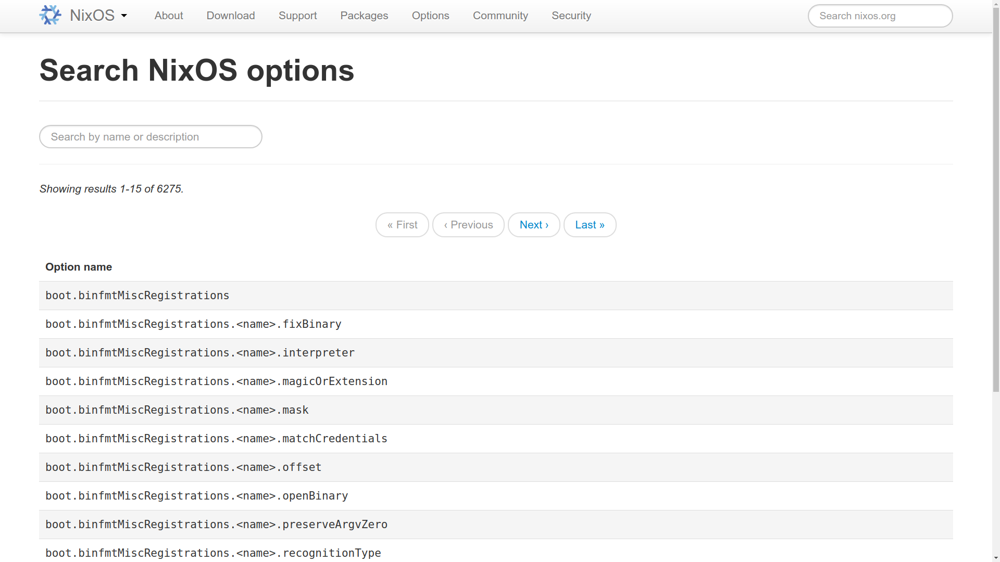
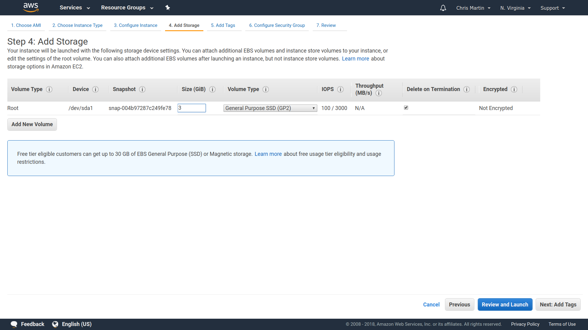
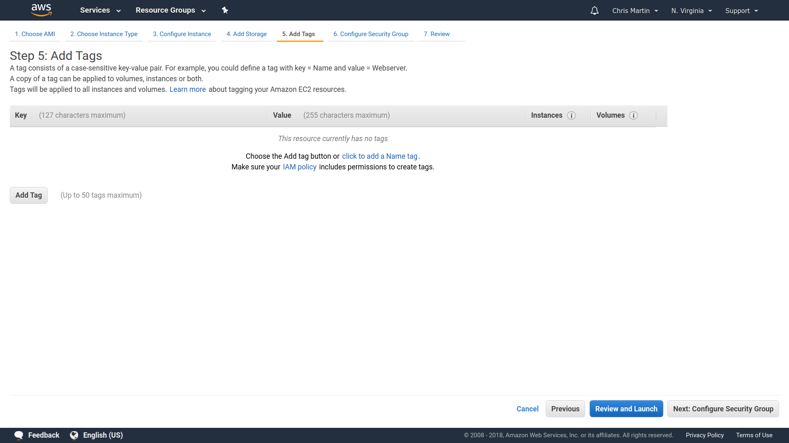
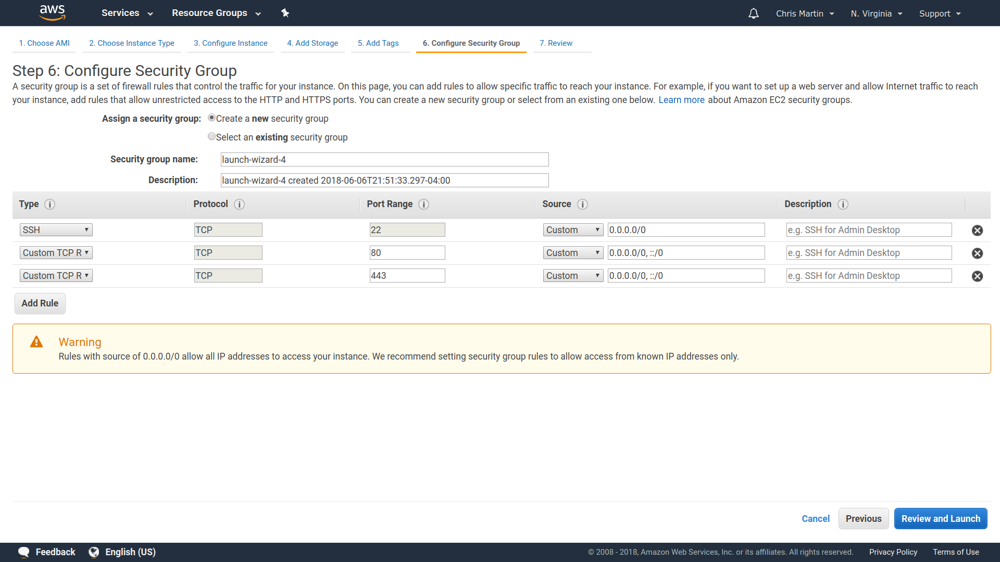
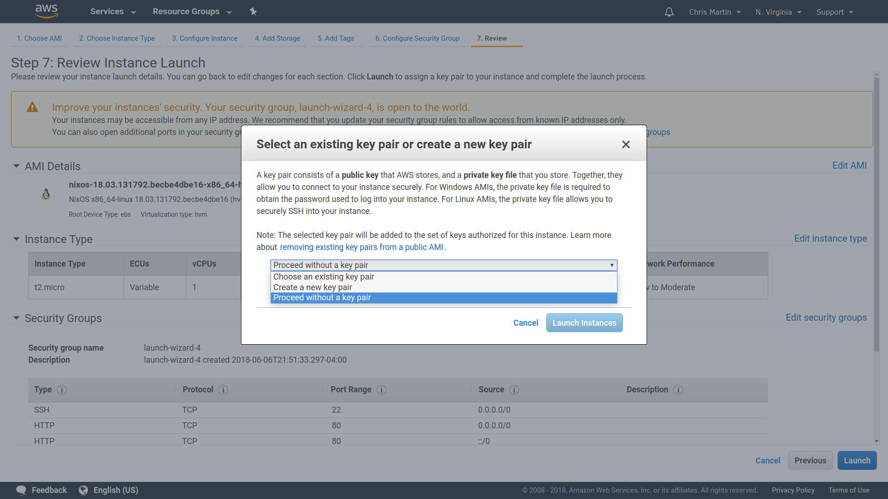

% Servers with Haskell and NixOS
% Chris Martin
% Monadic Party {height=2em} 2018 June 14-15

## Course goals

- Haskell is absolutely good for servers

- NixOS takes all the pain out of provisioning servers

- Not wizardry, a little boilerplate gets you started

::: notes
So, I was just reflecting on why I chose this subject for this class - to be honest, ops isn't my favorite subject, I think like a lot of us I just want to be able to write some Haskell code and I don't want to be spending my time thinking about how to run it, and getting my code onto servers is just sort of an annoyance.

So why am I here talking about stuff that I've admitted isn't a lot of fun, and asking you to get interested in it as well

- For one, it's because a lot of us *need* to deploy code and make our servers work, so if we're going to do it, let's do it properly, and pick tools that make it easy, so that we can get something working and shipped and go back to playing with profunctors as quickly as possible.
- And second, because there's a bit of a joke that Haskell code is only ever written and never run, and I really want to seriously dispel that idea.
:::

## Prerequisites

- General Linux familiarity

- Concepts: What is a process, web server, SSH

- Reading basic Haskell

::: notes
These aren't strict prerequisites, but just to sort of set expectations a bit, this is what I'm hoping most of you are familiar with.

I assume if you needed to learn Haskell, then Julie has already taught you everything you need to know.
:::

## Course outline

1. What are Nix and NixOS
1. Launching and configuring NixOS on EC2
1. Deploying by rebuilding NixOS locally
1. Building a Haskell project with Nix
1. Nixpkgs version pinning
1. Defining systemd units in NixOS
1. Basic web server with Scotty
1. Reverse proxying with nginx
1. Systemd socket activation
1. Journald and simple logging

## What we are *not* going to do

- We won't be talking about "serverless architecture"
    - I like servers

- We won't use Linux containers / Docker

- We use AWS, but this class is not about AWS

- Not analyzing performance

- Not using the Nix 2.0 `nix` command

::: notes
A couple months ago they released the "nix" command that's eventually going to encompass all of the other nix command line tools. I'm not going to recommend using this yet, because it's not complete, and just because I'm not all that familiar with it yet.
:::

## My platform history

- **PHP** (2003--2006) dumb projects

- **Java** (2006--2014) Georgia Tech Research Institute
    - J2EE Servlets
    - Tomcat

- **Python** (2014--2016) `https://use.foldapp.com`
    - {height=1.4em} Ubuntu
    - {height=1.4em} Salt

- **Haskell** (2017--now) `https://typeclasses.com`
    - {height=1.2em} NixOS

# Nix

## Origin

*The Purely Functional Software Deployment Model*, Eelco Dolstra, 2006

* > This thesis is about getting computer programs from one machine to another—and having
them still work when they get there.

* > This *should* be a simple problem. For instance, if the software consists of a set of files, then deployment should be a simple matter of *copying* those to the target machines.

## Portability is tricky

- Does your program have dynamically loaded libraries?
- What does it require on `PATH`?
- What do your dependencies depend on, etc.

::: notes
These are all problems of figuring out what files a program needs, and getting them where it expects to find them.

This is one reason people were really happy with the experience of Go, because by default the compiler produces statically linked binaries, and so you could actually just move an executable from one computer to another.
:::

## The main idea

*The Purely Functional Software Deployment Model*, Eelco Dolstra, 2006

* > The main idea of the Nix approach is to store software components in isolation from each other in a central component store, under path names that contain cryptographic hashes of all inputs involved in building the component, such as `/nix/store/rwmfbhb2znwp...-firefox1.0.4` [...] this prevents undeclared dependencies and enables support for side-by-side existence of component versions and variants.

* > The hash is computed over all inputs, including the following:
  > - The sources of the components.
  > - The script that performed the build.
  > - Any arguments or environment variables passed to the build script.
  > - All build time dependencies, typically including the compiler, linker, any libraries used at build time, standard Unix tools such as `cp` and `tar`, the shell, and so on.

## GNU make vs Nix

| | Make | Nix |
|----|------|------|
| Build unit | Targets | Derivations |
| Build file | List of targets | Lazy λ-calculus |
| Basis for rebuilds | Timestamps of build inputs | Hashes of build inputs |
| Where builds results go | Where you specify | In the Nix store (`/nix/store/...`) |
| How to remove old files | A target called `clean` | `nix-collect-garbage` |
| Composing build files | `include` | `import` |
| External dependencies | ? | `nixpkgs` |

::: notes
This is not a comparison that I've seen a lot of people make, but I like to start by comparing Nix to Make, since that's something most people have seen before, or at least heard of, so hopefully everybody has at least some vague sense of what Make does and what it's for.
:::

## Example

`https://archives.haskell.org/projects.haskell.org/diagrams/gallery/Hilbert.html`

{class=screenshot}

## `Makefile`

```make
all: hilbert-curve.png

sourceUrl = https://archives.haskell.org/projects.haskell.org/diagrams/gallery/Hilbert.lhs

hilbert-curve.lhs:
	wget $(sourceUrl) --output-document $@

hilbert-curve.svg: hilbert-curve.lhs
	runhaskell --ghc-arg=-XTypeFamilies $< --output $@ --width 250

hilbert-curve.png: hilbert-curve.svg
	convert $< $@

clean:
	rm -f *.lhs *.svg *.png

.PHONY: clean
```

:::notes
I will publish the slides after the course, so please don't feel a need to furiously copy down any code.
:::

## `default.nix`

```nix
let
    pkgs = import <nixpkgs> {};

    src = pkgs.fetchurl {
        url = https://archives.haskell.org/projects.haskell.org/diagrams/gallery/Hilbert.lhs;
        sha256 = "0bplymiysf4k9vlw2kf5dfzgk1w2r0w5pbr8m24wjk045rml5hqq";
    };

    ghc = pkgs.haskellPackages.ghcWithPackages (p: [ p.diagrams ]);

    svg = pkgs.runCommand "hilbert-curve.svg"
        { buildInputs = [ ghc ]; }
        "runhaskell --ghc-arg=-XTypeFamilies ${src} -o $out -w 250";

    png = pkgs.runCommand "hilbert-curve.png"
        { buildInputs = [ pkgs.imagemagick ]; }
        "convert ${svg} $out";

in
    png
```

## Annoyances with the `Makefile`

- Make didn't help us obtain GHC and imagemagick
- Changing the `Makefile` doesn't trigger a rebuild
- Make can't verify that we listed the right dependencies
- We have to write the `clean` rule ourselves

## Why Nix for servers?

- Builds are consistent
  - Doesn't depend on what's in your cache
  - If third-party hosted files change, the build will fail

- Deploy changes in one step
  - Doesn't matter what's already running on the server
  - Adding/removing/deleting a service happens automatically
  - Easy/quick to revert to a previous build

## NixOS config file

- Conventionally lives at `/etc/nixos/configuration.nix`
- Contains things like:
  - Software
  - Services + their configuration
  - Users
  - Host name
  - Firewall rules
  - Time zone
  - Kernel version

# AWS

## Launching on EC2

{class=screenshot}

::: notes
We start on the NixOS homepage, which invites us in with a big friendly green "Get NixOS" button.
:::

## `https://nixos.org/nixos/download.html`

{class=screenshot}

::: notes
This takes us to the download page, which has links to a handful of ways to install: USB sticks for your desktop, virtual machine images, and links to launch on Amazon EC2 and Microsoft Azure.

We're using AWS just because it's the platform I'm most familiar with. Amazon makes us choose which geographic region we want our server to run in; AWS does this because they power a lot of large businesses who care deeply about uptime -- if we make sure to spread out our servers over multiple regions, then even if, say, a hurricane knocks out Amazon data centers in some part of the world, our business can keep running. This is a more sophisticated concern than we care to think about right now, so just choose any region, perhaps preferring one on the same continent as you.
:::

## Step 2 -- Instance type

{class=screenshot}

::: notes
When you click "Launch", you'll be prompted to log into the AWS console if you are not already logged in. Then you'll get to the seven-step process for launching an instance.

Seven steps seems like a lot, and indeed it's a bit cumbersome. For AWS tasks that you perform repeatedly, you'll want to eventually wean off of the web console and learn to do them with the command line interface.

The first step is selecting the virtual machine image ("AMI," in Amazon parlance). The "Launch" button from the NixOS website included an appropriate choice of AMI and skipped us past this step, so we start on step 2.

The "instance type" determines (among other things) how many processors and how much RAM your server will get. It also affects the price. We aren't particularly demanding on our servers, so one of the smaller types like `t2.micro` will suffice. This gives us a single processor and 1 GB of memory.

You can run a `t2.micro` instance at no cost during your first year of using AWS, after which it will cost somewhere in the vicinity of $10/month (somewhere around 40 Zloty).
:::

## We're going very minimal here

> WHAT 1GB of mem is good enough? 🤔 skepticalface is skeptical.

::: notes
I'm sort of intentionally constraining myself here with such a small instance - I'm taking a somewhat extreme attitude of "if you can't run it in a gig of RAM, it's not worth running" - and this will really force us to not perform heavyweight operations on the server. So if I, for example, screw up some configuration and somehow trying to do something wrong like uploading GHC to the server, I'd rather that operation just fail.
:::

## Step 3 -- More configuration

{class=screenshot}

::: notes
A handful of configuration options we don't need to worry about for now - Except for this one that's at the very bottom. I don't know why they've tucked it away - you even have to click to expand the "Advanced Details" section to get to it - Because this setting is really great.
:::

## Default `configuration.nix` for EC2 instances

```nix
{
    imports = [ <nixpkgs/nixos/modules/virtualisation/amazon-image.nix> ];

    ec2.hvm = true;
}
```

## `https://nixos.org/nixos/options.html`

{class=screenshot}

## `bootstrap.nix`

::: notes
This is the config we're going to launch our instance with. I'm calling this file "bootstrap.nix" because it's the minimal config that we're just going to use to launch new instances.
:::

```nix
{
    imports = [ <nixpkgs/nixos/modules/virtualisation/amazon-image.nix> ];

    config = {
        ec2.hvm = true;

        # Run SSH on a weird port
        services.openssh.ports = [ 46861 ];
        networking.firewall.allowedTCPPorts = [ 46861 ];

        # Don't allow anyone to SSH using a password
        services.openssh.passwordAuthentication = false;

        # Let admins sudo without entering a password
        security.sudo.wheelNeedsPassword = false;

        # Let admins upload unsigned Nix packages
        nix.trustedUsers = [ "@wheel" ];

        users.users.chris = {
            isNormalUser = true;
            extraGroups = [ "wheel" ];

            openssh.authorizedKeys.keys = [
                "ssh-rsa AAAAB3NzaC1yc2EAAAADAQABAAACAQDFJ4UYsEh+JZQGCMdbNrKfjH1F3rwKBRewwgaehwnijBADYSJ8iwDZji09vVfCxSQSMjZJS54mEBtjcOBOpM7+mR585wI6jhsfdsNqNwzJdxV47Bi4jAkg7XlWf9IYv7EUhRzsKGdoSqefh/7bN6MPcJQ9ccHKqBxtmGJ6eHfgLmgnb8+ozwDlwQKz5QDtdEnt8TUqucUB4AOyReBV7GRnwkTyGCForb5nhTftuVi7GO1qApJKBIpYlC1gbuCWDX9CIl7IzfAMyng6u6Ty9x31ZWKA0sJzRIX5cw3e8Ct7sWzZB3O/2FOwjyYadqTRQdR472Dz/f6mqqIl1ioxzfXRfh33bREg2opLc6bnYaWTXY6aAc5/wUbC7z4CTKBGZJHxY5mrRSlpQ2Rn8EvgyyxgxokLdTZqoiKw/tSmE9Mlle5JGh+m8agGe41dszZxBf41j/ORE+N5p0k02fvUWuG0PL3aFE77qUbOgxxXOYMtBV0YiJPzeBXDGrkW1wqKC2voJ6PuCZWOHaLxDqkUDgAMYyGMKoj5C53OZneVeSMgZG+/lxygAduyBx/RfQYrt4WsPfPnhl95Kxx8PTYuFfLXmcMNMhZ7rYW+Thvo40W+VjiqTUSCxLHr16SFSOj2mGl0A29VPPHA3H+ckprCo8pldPo3AYrwkV/zHlyLjuEQfQ== renzo-1"
            ];
        };

        users.users.julie = {
            isNormalUser = true;
            extraGroups = [ "wheel" ];

            openssh.authorizedKeys.keys = [
                "ssh-rsa AAAAB3NzaC1yc2EAAAADAQABAAACAQDUA5QiRaMriKQrvA1H74UsJcnGieAcHYrHp27KBZjOhhKvinTkNyErY5JNFbgrCh3oC+6HeMSUOp+5qb2/hF0aO6kdYbGnYB3BchrbsPYFDccqW9eQONXdvYsa4mavfLzHIvXktkxVsd71CBRXqVFxxolYps99iJvFfhmgnn9Iz+zUIuOSRCPQ/Bcxbh3+fZHD2wlPpOZ352V3/utR6n6nlhK5W1Gq/mp5dmE32zCEOEse85xXQNxJpjdhIDZbu8PnNo2LuYIfRBFzIj/Gh6MIHJU3gQskt8MvKA+POdseflPLznxoDWYT3FqBO+agObr3FGnlnwpi1g9ym+U8T6SNFGUwR7cX5VkegLNSl7FTLMtaXoqUTKhBQH+ZIpNwlyepYnFo1BHR3IgsFDSaD/zLUjesBQIw6j+mtDCK9P3EnUcXo5v04OuGoyqTtAF4TTAz2kuC8ZsCs0cQEZRIoXqVIRcvPmlFr208o0SeGakCHVxIj6VnrQ+aHisVwuGAkq+Kb5mwE6b0xvuFGHo+bqHIUePymWQihbh0pZpYeSaJTLb2YG17HmE2rUFeO66CADmIMi2EWEI0xisT/e9FoqDcMnG/Z5sLBBDkerXwyfLA63zAkF0P3LtWX1Q0vYFhCn+VtMwE56qW/Z0sDdNiVwxn/a1GGh12gqXkNHBEePYjoQ== doriangray"
            ];
        };
    };
}
```

## Step 4 -- Storage

{class=screenshot}

::: notes
The disk capacity defaults to 3 GB. This is certainly too small. The main Type Classes server currently uses 5 GB of its storage. I like to provide plenty of padding here because you don't want to run out of storage on a running server, so I think 30 GB is a good standard choice.
:::

## Step 5 -- Tags

{class=screenshot}

::: notes
Another AWS feature we don't need to think about right now.
:::

## Step 6 -- Security group

{class=screenshot}

::: notes
By default, your instance is tightly firewalled and no incoming traffic can reach it. The security group is what lets you relax the rules and specify what ports you need to accept connections on. At minimum we'll need port 22 (the standard port for SSH). Since Type Classes is a website, we also accept on ports 80 and 443 (the standard ports for HTTP and HTTPS). It's very easy to forget about security groups; in general, if something among your EC2 instances isn't working, it's likely that it's because you forgot to allow a port in some security group. If you don't already have an appropriate security group created, this step lets you create a new one right here.
:::

## Step 7 -- Review

{class=screenshot}

::: notes
The last step just shows you a summary of what you've entered in the previous steps.

Then once you click "Launch" in the bottom-right, you get an additional bonus step. The normal default way to launch an EC2 instances is: Amazon generates a secret key for you, you download it here in this step, and then you use it to SSH into the machine. We're being more clever than that because we already set up our SSH authorized keys in the NixOS config, so we can skip over this whole step.
:::

## Launching via command-line

```
❮bash❯ aws ec2 run-instances [... a bunch of args ...]
```

# Deploy strategy

## Deploy strategy

::: notes
We gave this machine a pretty small amount of memory, so any nontrivial build is likely to run out of memory and fail. Plus, in the interest of keeping our servers as responsive to user requests as possible, we don't really want to waste their time compiling packages. So next we'll come up with a better way to deploy.
:::

- NixOS is a Nix package

- Nix packages are easy to copy between machines
    - (of the same platform; sorry macOS users)

- Build NixOS locally, upload to the server

## Deploy strategy

{class=diagram}

::: notes
Fortunately, we can take advantage of the fact that "the entire server" is a Nix package, and Nix packages are extremely portable; we can build them on one machine and then ship them off to another. That's what we're going to do here: Build all of NixOS on our local development machine, and then upload it to the server.
:::

## `server.nix`

::: notes
You want to keep the `bootstrap` file unmodified, since that's what you'll use in the future to launch new instances. It should stay minimal so that your server can launch fast, and it can't be split into multiple files because that Amazon "user data" mechanism only supports one file.

So instead of modifying it, we're just going to import it here, and later we'll just keep adding more files to the import list. You'll see what I mean in a bit when we start talking about how to define a service.
:::

```nix
let
    nixos = import <nixpkgs/nixos> {
        configuration = {
            imports = [
                ./modules/bootstrap.nix
            ];
            config = {
            };
        };
    };
in
    nixos.system
```

## Building NixOS locally

```
❮bash❯ nix-build server.nix
[... a bunch of build output ...]
/nix/store/bbcbh0vv64v5bgdhdd4a8fw3p438iiam-nixos-system-unnamed-18.03.132618.0f73fef53a9

❮bash❯ ls -lh
ls -lh
total 12K
-rw-r--r-- 1 chris users 2.2K Jun  7 02:30 bootstrap.nix
lrwxrwxrwx 1 chris users   89 Jun  7 02:35 result -> /nix/store/pvf3l9x8m2fnw7l07g1yxw1iilj3m2rp-nixos-system-unnamed-18.03.132618.0f73fef53a9
-rw-r--r-- 1 chris users  176 Jun  7 02:30 server.nix
```

::: notes
If we copy the `configuration.nix` file that launched the server with, and throw this bit of boilerplate into a file called `server.nix`...

Then we can build NixOS for our server using the `nix-build` program, giving it `server.nix` as an argument to specify what we want it to build.

The files get created somewhere within `/nix/store`; the output of this command includes the path of the directory containing the build result. `nix-build` also creates a symlink called `result` which points to that path. This is convenient in a lot of cases, but we're not going to take advantage of this feature here, so in the future I'll always use `nix-build` with the `--no-out-link` flag to prevent it from creating `result`. It's harmless, but we just don't need it.

So that's it -- The build step is quite simple.
:::

## The build result

::: notes
If we look *inside* the result directory, we can notice some interesting things:

- This looks a bit like the kind of stuff you'd find at the root of a linux filesystem. We've got `bin` and `etc` directories.

- Most of the things in here are also symlinks. This is very common. Most Nix packages are built up from a ton of symlinks to other packages, which prevents a lot of unnecessary duplication.

- All of the timestamps are zero.

- Everything is owned by root and non-writable.
:::

```
❮bash❯ ls -lh result/
total 60K
dr-xr-xr-x 2 root root 4.0K Dec 31  1969 bin
dr-xr-xr-x 2 root root 4.0K Dec 31  1969 fine-tune
-r-xr-xr-x 1 root root  13K Dec 31  1969 activate
lrwxrwxrwx 1 root root   91 Dec 31  1969 append-initrd-secrets -> /nix/store/m2jf41zpw52i10j01p4wij6j2h22721j-append-initrd-secrets/bin/append-initrd-secrets
-r--r--r-- 1 root root    0 Dec 31  1969 configuration-name
lrwxrwxrwx 1 root root   51 Dec 31  1969 etc -> /nix/store/iwpgvdg2i4vv6a0vd20d70425s0rifdh-etc/etc
-r--r--r-- 1 root root    0 Dec 31  1969 extra-dependencies
lrwxrwxrwx 1 root root   65 Dec 31  1969 firmware -> /nix/store/grzr4r1ajmnjjnq049r719jbj2p8zbcp-firmware/lib/firmware
-r-xr-xr-x 1 root root 4.9K Dec 31  1969 init
-r--r--r-- 1 root root    9 Dec 31  1969 init-interface-version
lrwxrwxrwx 1 root root   57 Dec 31  1969 initrd -> /nix/store/bnqw7sxz3pnakni5hmj22dqrqvjbbq1m-initrd/initrd
lrwxrwxrwx 1 root root   65 Dec 31  1969 kernel -> /nix/store/y0jcw44kw1962bdfnsayz1r6jsgz2sqj-linux-4.14.44/bzImage
lrwxrwxrwx 1 root root   58 Dec 31  1969 kernel-modules -> /nix/store/yw9zkbwkb76ypb0gvvakg0lkv1zirqg7-kernel-modules
-r--r--r-- 1 root root   51 Dec 31  1969 kernel-params
-r--r--r-- 1 root root   24 Dec 31  1969 nixos-version
lrwxrwxrwx 1 root root   55 Dec 31  1969 sw -> /nix/store/j85qcbjfwmis0c75qwbvxhirlj02kjmw-system-path
-r--r--r-- 1 root root   12 Dec 31  1969 system
lrwxrwxrwx 1 root root   55 Dec 31  1969 systemd -> /nix/store/cya0k4g78bd518wzgqghkk6srlvl2jgv-systemd-237
```

# `deploy.hs`

## Standard boilerplate

```haskell
#! /usr/bin/env stack
-- stack script --resolver lts-11.8 --no-nix-pure

{-# LANGUAGE OverloadedStrings #-}

import Turtle

main :: IO ()
main = ...
```

::: notes
Getting the build result running on the server takes a few steps, so we wrote a script to do it.

Things to notice here:

- We're using a stack shebang, which is really convenient for short scripts, but it has some downsides:
  - You can't break up your program into multiple modules
  - There's no easy way (as far as I know) to just run the typechecker; all you can do with this script is try to run it.

- We're using the `stack script` command, which lets us import modules without declaring what packages they come from.

- We're using the turtle package by Gabriel Gonzalez, which provides a bucket of utilities designed for writing things that sort of resemble Bash scripts. The turtle package uses the `Text` type extensively, so you'll always want to turn on overloaded strings when you use it.

:::

## `main`

```haskell
main :: IO ()
main =
  sh $ do
    server <- getServer   -- Read the server address from a file
    path <- build         -- (1) Build NixOS for our server
    upload server path    -- (2) Upload the build to the server
    activate server path  -- (3) Start running the new version
```

{width=30em}

::: notes
We run the whole program inside turtle's `Shell` monad, using `sh :: Shell a -> IO ()` at the top of `main` to run it.

Even in small scripts, there's no need to sacrifice type safety. The deploy script involves two different kinds of strings, so let's define a newtype for each.
:::

## Types

```haskell
-- The path of the NixOS build that we're deploying, e.g.
-- "/nix/store/bbcbh0vv64v5bgdhdd4a8fw3p438iiam-nixos-system-unnamed-18.03.132618.0f73fef53a9"
newtype NixOS = NixOS Text

-- The address of the server to which we're deploying, e.g. "54.175.33.139"
newtype Server = Server Text
```

## `getServer`

```haskell
-- Read the server address from a file.
getServer :: Shell Server
getServer =
  do
    line <- single (input "server-address.txt")
    return (Server (lineToText line))
```

::: notes
For now we have a very simple setup with a single server. We keep the IP address of the server in a file called `server-address.txt`, and the `getServer` action reads the contents of that file.
:::

## `build`

```haskell
-- Build NixOS for our server.
build :: Shell NixOS
build =
  do
    line <- single (inproc command args empty)
    return (NixOS (lineToText line))

  where
    command = "nix-build"
    args = ["server.nix", "--no-out-link"]
```

::: notes
The build action runs the `nix-build` command that we worked out in the previous section.
:::

## `upload`

```haskell
-- Upload the build to the server.
upload :: Server -> NixOS -> Shell ()
upload (Server server) (NixOS path) =

    procs command args empty

  where
    command = "nix-copy-closure"
    args = ["--use-substitutes", server, path]
```

::: notes
Once we've built NixOS, we need to upload it to the server. For this purpose, Nix provides the `nix-copy-closure` command.
:::

## `activate`

```haskell
{-# LANGUAGE QuasiQuotes #-}
import NeatInterpolation (text)

-- Start running the new version of NixOS on the server.
activate :: Server -> NixOS -> Shell ()
activate (Server server) (NixOS path) =

    procs command args empty

  where
    command = "ssh"
    args = [server, remoteCommand]
    profile = "/nix/var/nix/profiles/system"
    remoteCommand = [text|
        nix-env --profile $profile --set $path
        $profile/bin/switch-to-configuration switch
      |]
```

## Running the deploy script

```
❮bash❯ ./deploy.hs
[... a bunch of build output ...]
updating GRUB 2 menu...
activating the configuration...
setting up /etc...
setting up tmpfiles
```

# Haskell project structure

## Haskell project structure

- What we deploy should be compiled as a Nix package
  - `default.nix`
  - Any change to the source causes a new rebuild from scratch
- But we want to use normal tools in development
  - `shell.nix`
  - Incremental compiles of only modules that change
  - Use tools like hlint, stylish-haskell, ghcid

- ```
  monadic-party
  ├── default.nix
  ├── ghc-version.nix
  ├── monadic-party.cabal
  ├── shell.nix
  ├── app
  │   └── party-server.hs
  └── lib
      └── PartyServer.hs
  ```

::: notes
We do *not* want to do a full rebuild of the Nix package to test our code! It's not enough to give developers a way to build your code. You need to be able to give people a way to easily set up an environment where they can run incremental compiles, open a REPL, etc.

This means that when you deploy, you're going to have to compile everything for a second time, and it's going to be kinda slow because each changed package is going to be compiled from scratch. And in my opinion, *this is how it ought to be.* The incremental compiles that you do in development need to be fast, but the compiles that you do for deployment need to be reliable.

The reason I always have a separate `lib` directory is that most of the Haskell tooling does not work on the source code for executables. I keep the `app` directory nearly empty because ghcid doesn't show me compile errors in it.
:::

## `monadic-party/ghc-version.nix`

```nix
"ghc822"
```

## `monadic-party/default.nix`

```nix
{ pkgs }:

let

    ghc = pkgs.haskell.packages.${import ./ghc-version.nix};

    developPackage =
      { root
      , source-overrides ? {}
      , overrides ? self: super: {}
      }:
      let
          extensions = pkgs.lib.composeExtensions
              (ghc.packageSourceOverrides source-overrides)
              overrides;

          ghc' = ghc.extend extensions;

          package = ghc'.callCabal2nix (builtins.baseNameOf root) root {};

      in
          pkgs.haskell.lib.overrideCabal package (drv: {
              enableSharedExecutables = false;
              isLibrary = false;
              doHaddock = false;
              postFixup = "rm -rf $out/lib $out/nix-support $out/share/doc";
          });

in

developPackage {

  root = ./.;

  source-overrides = {

    # Any specific Haskell package versions you need to pin go here, e.g.:
    # scotty = "0.11.1";

  };

}
```

## `monadic-party/shell.nix` (basic)

```nix
let
    pkgs = import <nixpkgs> { config.allowUnfree = true; };

    monadic-party = import ./default.nix { inherit pkgs; };

in
    monadic-party
```

## `monadic-party/shell.nix` (with dev tools)

```nix
let
    pkgs = import <nixpkgs> { config.allowUnfree = true; };

    monadic-party = import ./default.nix { inherit pkgs; };

    ghc = pkgs.haskell.packages.${import ./ghc-version.nix};

    cabal = ghc.cabal-install;

    party-ghci = pkgs.writeScriptBin "party-ghci"
        ''
            ${cabal}/bin/cabal new-repl "$@"
        '';

    party-ghcid = pkgs.writeScriptBin "party-ghcid"
        ''
            ${ghc.ghcid}/bin/ghcid --command "${cabal}/bin/cabal new-repl" "$@"
        '';

    devTools = [
        party-ghci
        party-ghcid
    ];

in
    monadic-party.env.overrideAttrs (attrs: {
        buildInputs = attrs.buildInputs ++ devTools;
    })
```

## Using our dev tools

```
❮bash❯ nix-shell --pure --run 'party-ghci'
In order, the following will be built (use -v for more details):
 - monadic-party-0 (lib) (first run)
Preprocessing library for monadic-party-0..
GHCi, version 8.2.2: http://www.haskell.org/ghc/  :? for help
Loaded GHCi configuration from /home/chris/.ghc/ghci.conf
[1 of 1] Compiling PartyServer      ( lib/PartyServer.hs, interpreted )
Ok, one module loaded.

λ>
```

## `monadic-party/monadic-party.cabal`

```cabal
name: monadic-party
version: 0

cabal-version: >= 1.10
build-type: Simple

library
    hs-source-dirs: lib

    exposed-modules:
        MonadicParty.Scotty

    build-depends:
        base
      , neat-interpolation
      , scotty
      , text

    ghc-options: -Wall
    default-language: Haskell2010

executable party-scotty
    hs-source-dirs: app
    main-is: party-scotty.hs

    build-depends:
        base
      , monadic-party

    ghc-options: -Wall
    default-language: Haskell2010
```

::: notes
My cabal stanzas are intentionally structured to draw attention to the things you care about most often.

- The first chunk tells you where the code is.
- The module and dependency lists are the things you look at most, so they're separated into their own little sections by a blank line.
- The ghc-options and default-language are standard boilerplate so they go at the bottom.
:::

# Web server

## Haskell libraries for web servers

- http-types, cookies
- wai, warp
- scotty
- Spock
- Servant
- Yesod

::: notes
These are sort of listed in order of increasing complexity.

I never really watched Star Trek, so it took me a long time to notice the motif among these - wrap, scotty, and spock.
:::

## `monadic-party/lib/MonadicParty/Scotty.hs`

```haskell
{-# LANGUAGE OverloadedStrings, QuasiQuotes #-}

module MonadicParty.Scotty (main) where

-- base
import qualified System.IO as IO

-- neat-interpolation
import NeatInterpolation

-- scotty
import qualified Web.Scotty as Scotty

-- text
import qualified Data.Text.Lazy

main :: IO ()
main =
    Scotty.scotty 8000 scottyApp

scottyApp :: Scotty.ScottyM ()
scottyApp =
    Scotty.get "/scotty" $
        Scotty.html (Data.Text.Lazy.fromStrict [text|
            <!doctype html>
            <html>
                <head></head>
                <body>
                    Hello, I am a very basic Scotty demo,
                    serving (internally) on port 8000.
                </body>
            </html>
          |])
```

## `server.nix`

```nix
let
    nixos = import <nixpkgs/nixos> {
        configuration = {
            imports = [
                ./modules/bootstrap.nix
                ./modules/party-scotty.nix
                ./modules/nginx.nix
            ];
            config = {
                networking.hostName = "monadic-party";
                nixpkgs.config.allowUnfree = true;
            }
        };
    };
in
    nixos.system
```

::: notes
This is the same config as before, but now we've modified it to add another import: the party server.
:::

## `modules/party-scotty.nix`

```nix
{ pkgs, ... }:
{
    imports = [
    ];
    config = {
        systemd.services.party-scotty = {
            enable = true;
            description = "Monadic Party - Scotty";
            wantedBy = ["multi-user.target"];

            environment = {
                LC_ALL = "en_US.UTF-8";
                LOCALE_ARCHIVE = "${pkgs.glibcLocales}/lib/locale/locale-archive";
            };

            serviceConfig = {
                User = "monadic-party";
                Restart = "on-failure";
                ExecStart = "${import ../monadic-party { inherit pkgs; }}/bin/party-scotty";
            };
        };
    };
}
```

## `modules/nginx.nix`

```nix
{ pkgs, ... }:
{
    imports = [
    ];
    config = {

        networking.firewall.allowedTCPPorts = [ 80 443 ];

        services.nginx = {
            enable = true;

            virtualHosts."monadic-party.chris-martin.org" = {

                enableACME = true;

                locations."/scotty".proxyPass =
                    "http://localhost:8000";
            };
        };
    };
}
```

# Systemd-activated sockets

## `modules/party-socket.nix`

```nix
{ pkgs, ... }:
{
    config = {
        systemd.services.party-socket = {
            enable = true;
            description = "Monadic Party - Socket";
            wantedBy = ["multi-user.target"];
            requires = ["party-socket.socket"];

            environment = {
                LC_ALL = "en_US.UTF-8";
                LOCALE_ARCHIVE = "${pkgs.glibcLocales}/lib/locale/locale-archive";
            };

            serviceConfig = {
                User = "monadic-party";
                Restart = "on-failure";
                ExecStart = "${import ../monadic-party { inherit pkgs; }}/bin/party-socket";
            };
        };

        systemd.sockets.party-socket = {
            wantedBy = ["sockets.target"];
            socketConfig = {
                ListenStream = "/run/party-socket.socket";
            };
        };
    };
}
```

## `monadic-party/lib/MonadicParty/Socket.hs`

```haskell
{-# LANGUAGE OverloadedStrings, QuasiQuotes,
             ScopedTypeVariables, TypeApplications #-}

module MonadicParty.Socket (main) where

-- base
import System.Exit (die)

-- data-default-class
import Data.Default.Class (def)

-- neat-interpolation
import NeatInterpolation

-- network
import Network.Socket (Socket)
import qualified Network.Socket as Socket

-- scotty
import qualified Web.Scotty as Scotty

-- socket-activation
import Network.Socket.Activation (getActivatedSockets)

-- text
import qualified Data.Text.Lazy

main :: IO ()
main = do

    socketsMaybe :: Maybe [Socket] <- getActivatedSockets

    case socketsMaybe of

        Just [socket] ->
          do
            Socket.setNonBlockIfNeeded (Socket.fdSocket socket)
            Scotty.scottySocket (def @Scotty.Options) socket scottyApp

        Just sockets -> die ("Wrong number of sockets: " ++
                             show (length sockets))

        Nothing -> die "Not socket activated"

scottyApp :: Scotty.ScottyM ()
scottyApp =
    Scotty.get "/socket" $
        Scotty.html (Data.Text.Lazy.fromStrict [text|
            <!doctype html>
            <html>
                <head></head>
                <body>
                    This one is socket activated.
                </body>
            </html>
          |])
```

## Curling a Unix socket

```
❮bash❯ curl --unix-socket /run/party-socket dummydomain/socket
hello
```

# Nixpkgs version pinning

## Why pinning

- I lied about reproducible builds
- But we can fix it

::: notes
We're going to take a side detour here to something I really should have done from the start, but I think everybody's here for Haskell and I didn't want to burn you out by frontloading *too much* nix.
:::

## `NIX_PATH`

- Typically `NIX_PATH=$HOME/.nix-defexpr/channels`

- `<nixpkgs>` = `$NIX_PATH/nixpkgs`

- `<nixpkgs/nixos>` = `$NIX_PATH/nixpkgs/nixos`

- `nix-channel --update` changes the nixpkgs expression!

## `nixpkgs.nix`

```nix
# nix-prefetch-url --unpack https://github.com/NixOS/nixpkgs/archive/<rev>.tar.gz

(import <nixpkgs> { }).fetchFromGitHub {
  owner = "NixOS";
  repo = "nixpkgs";

  # NixOS 18.03, 2018 Mar 18
  rev = "0e7c9b32817e5cbe61212d47a6cf9bcd71789322";
  sha256 = "1dm777cmlhqcwlrq8zl9q2d87h3p70rclpvq36y43kp378f3pd0y";
}
```

## `deploy.hs`

```haskell
main :: IO ()
main =
  sh $ do
    nixpkgs <- getNixpkgs
    setNixPath nixpkgs

    server <- getServer   -- Read the server address from a file
    path <- build         -- (1) Build NixOS for our server
    upload server path    -- (2) Upload the build to the server
    activate server path  -- (3) Start running the new version

getNixpkgs :: Shell Nixpkgs
getNixpkgs =
  do
    line <- single (inproc command args empty)
    return (Nixpkgs (lineToText line))

  where
    command = "nix-build"
    args = ["nixpkgs.nix", "--no-out-link"]

setNixPath :: Nixpkgs -> Shell ()
setNixPath (Nixpkgs path) =
    export "NIX_PATH" ("nixpkgs=" <> path)
```
